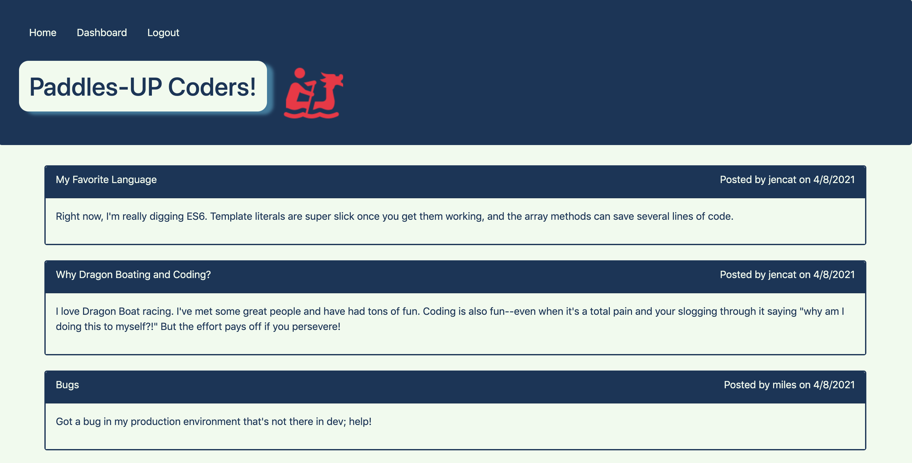

# Paddles-Up Coder

  ## Badge

  

  ## Description

  A blog for Dragon Boat Racing, Web-development, and all that falls between!
  
  Visit the live site [here](https://paddlesup-coder.herokuapp.com/)!

  

  ## Table of Contents
  
  - [Installation](#Installation)
  - [Usage](#Usage)
  - [Credits](#Credits)
  - [Contributing](#Contributing)
  - [Test](#Tests)
  - [Questions](#Questions)
  - [License](#License)
  
  ## Installation

  ```bash
  Cloning the repo and save in desired location, then run npm i to install dependencies.
  ```

  [Back to Table of Contents](#table-of-contents)
  
  ## Usage

  After installing dependencies, create an env file to store the database name, password, and user information.  Next, run the supplied schema in your MySQL database.  The seed file is not required to run the blog, but if you wish to, you can seed the database by entering npm run seed in your terminal.  
  
  Next enter 'npm start' in your terminal to start the server.  Once the server is running you see the homepage in your brower, sign-up to create a user profile and begin blogging!

  [Back to Table of Contents](#table-of-contents)
  
  ## Credits

  This blog was created with node.js, sequelize, express-session, express-handlebars, connect-session-sequelize, bcrypt, mysql2, and is powered by JavaScript.  
  
  Design resources include: Bootstrap, Coolers, and icons8.

  [Back to Table of Contents](#table-of-contents)
  
  ## Contributing
  
  Please review the community standards for contributing to this project, adopted from the [Contributor Covenant](https://www.contributor-covenant.org/).

  [Back to Table of Contents](#table-of-contents)
  
  ## Tests

  ```bash
  none
  ```

  [Back to Table of Contents](#table-of-contents)

  
  ## Questions
  
  Questions? You can reach me by email at jennifer.nelson242@gmail.com. Feel free to check out additional projects at [my GitHub profile](https://github.com/jnel-221).

  [Back to Table of Contents](#table-of-contents)
  
  ## License

  This project is licensed under the terms of the The Unlicense license.
  
  [Back to Table of Contents](#table-of-contents)